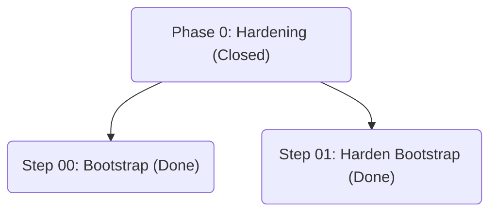
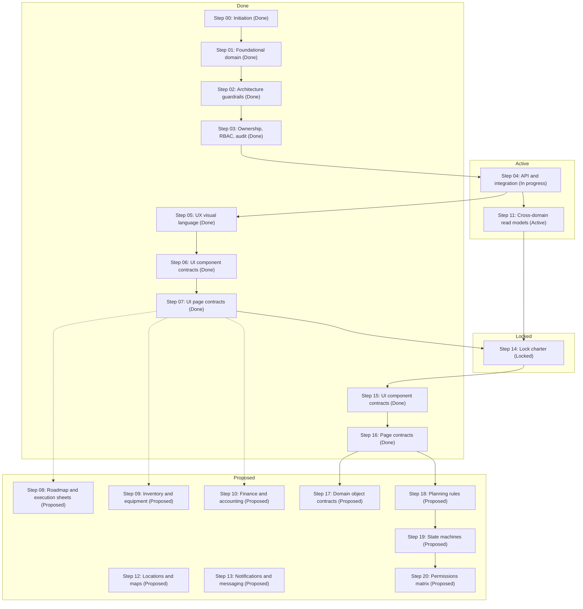

# Roadmap Overview

The roadmap traces sealed Phase 0 guardrails, locked Phase 1 documentation, and the additive Phase 2 architecture rollout. Each phase diagram below mirrors the authoritative step files and is also stored in its respective directory for reuse.

## Table of Contents
- [Phase 0](#phase-0)
- [Phase 1](#phase-1)
- [Phase 2](#phase-2)

## Phase 0

See also: [docs/roadmap/phase0/diagram.md](phase0/diagram.md).

## Phase 1

See also: [docs/roadmap/phase1/diagram.md](phase1/diagram.md).

## Phase 2

```mermaid
graph TD
  P2("Phase 2: Architecture and Delivery")
  P2 --> S201["Step 01: High level architecture (Starting)"]
  P2 --> S202["Step 02: Low level architecture (Starting)"]
  P2 --> S203["Step 03: Persistence model (Starting)"]
  P2 --> S204["Step 04: API architecture (Starting)"]
  P2 --> S205["Step 05: Async and jobs (Starting)"]
  P2 --> S206["Step 06: Security and trust (Starting)"]
  P2 --> S207["Step 07: Frontend architecture (Starting)"]
  P2 --> S208["Step 08: Deployment and environments (Starting)"]
  P2 --> S209["Step 09: Observability and operations (Starting)"]
  P2 --> S210["Step 10: Implementation bootstrap (Starting)"]
  P2 --> S211["Step 11: First vertical slice (In progress)"]
  P2 --> S212["Step 12: Execution governance (Starting)"]
  P2 --> S213["Step 13: Testing strategy and harness (In progress)"]
```

See also: [docs/roadmap/phase2/diagram.md](phase2/diagram.md).
