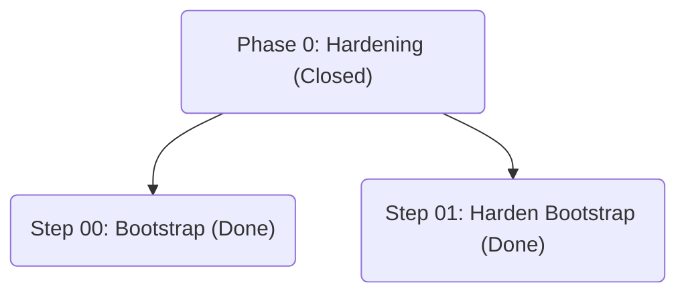

# Phase 0 Diagram

```mermaid
graph TD
  P0("Phase 0: Hardening (Closed)")
  P0 --> S00("Step 00: Bootstrap (Done)")
  P0 --> S01("Step 01: Harden Bootstrap (Done)")
```

Phase 0 is sealed; amendments require explicit changelog entries and guard validation.
