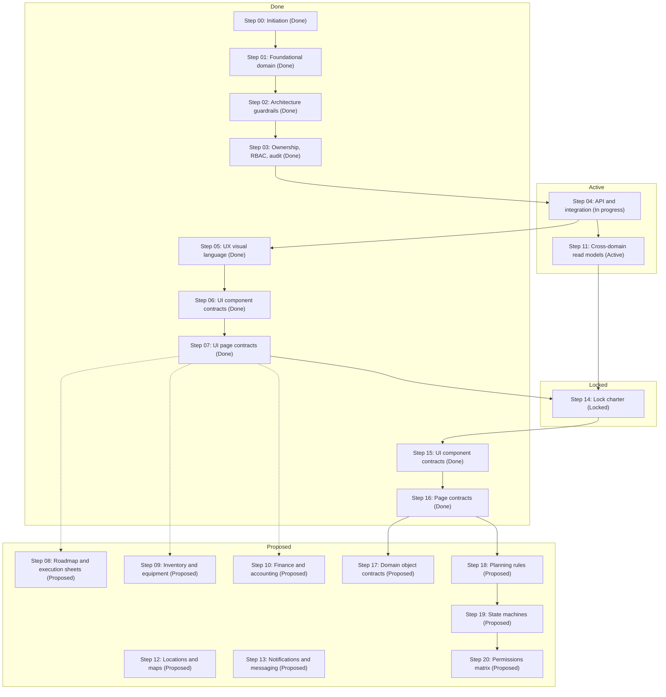

# Phase 1 Diagram

```mermaid
graph TD
  subgraph Done
    S100["Step 00: Initiation (Done)"]
    S101["Step 01: Foundational domain (Done)"]
    S102["Step 02: Architecture guardrails (Done)"]
    S103["Step 03: Ownership, RBAC, audit (Done)"]
    S105["Step 05: UX visual language (Done)"]
    S106["Step 06: UI component contracts (Done)"]
    S107["Step 07: UI page contracts (Done)"]
    S115["Step 15: UI component contracts (Done)"]
    S116["Step 16: Page contracts (Done)"]
  end

  subgraph Active
    S104["Step 04: API and integration (In progress)"]
    S111["Step 11: Cross-domain read models (Active)"]
  end

  subgraph Proposed
    S108["Step 08: Roadmap and execution sheets (Proposed)"]
    S109["Step 09: Inventory and equipment (Proposed)"]
    S110["Step 10: Finance and accounting (Proposed)"]
    S112["Step 12: Locations and maps (Proposed)"]
    S113["Step 13: Notifications and messaging (Proposed)"]
    S117["Step 17: Domain object contracts (Proposed)"]
    S118["Step 18: Planning rules (Proposed)"]
    S119["Step 19: State machines (Proposed)"]
    S120["Step 20: Permissions matrix (Proposed)"]
  end

  subgraph Locked
    S114["Step 14: Lock charter (Locked)"]
  end

  S100 --> S101 --> S102 --> S103 --> S104
  S104 --> S105 --> S106 --> S107 --> S114
  S114 --> S115 --> S116 --> S117
  S116 --> S118 --> S119 --> S120
  S107 -.-> S108
  S107 -.-> S109
  S107 -.-> S110
  S111 --> S114
  S104 --> S111
```

Phase 1 remains locked by Step 14; any amendments must reference that charter and supply migration notes.
