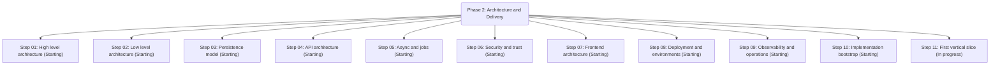

# Phase 2 Diagram

```mermaid
graph TD
  P2("Phase 2: Architecture and Delivery")
  P2 --> S201["Step 01: High level architecture (Starting)"]
  P2 --> S202["Step 02: Low level architecture (Starting)"]
  P2 --> S203["Step 03: Persistence model (Starting)"]
  P2 --> S204["Step 04: API architecture (Starting)"]
  P2 --> S205["Step 05: Async and jobs (Starting)"]
  P2 --> S206["Step 06: Security and trust (Starting)"]
  P2 --> S207["Step 07: Frontend architecture (Starting)"]
  P2 --> S208["Step 08: Deployment and environments (Starting)"]
  P2 --> S209["Step 09: Observability and operations (Starting)"]
  P2 --> S210["Step 10: Implementation bootstrap (Starting)"]
  P2 --> S211["Step 11: First vertical slice (In progress)"]
```

Phase 2 builds on Phase 1 contracts and remains additive to the locked documentation set.
