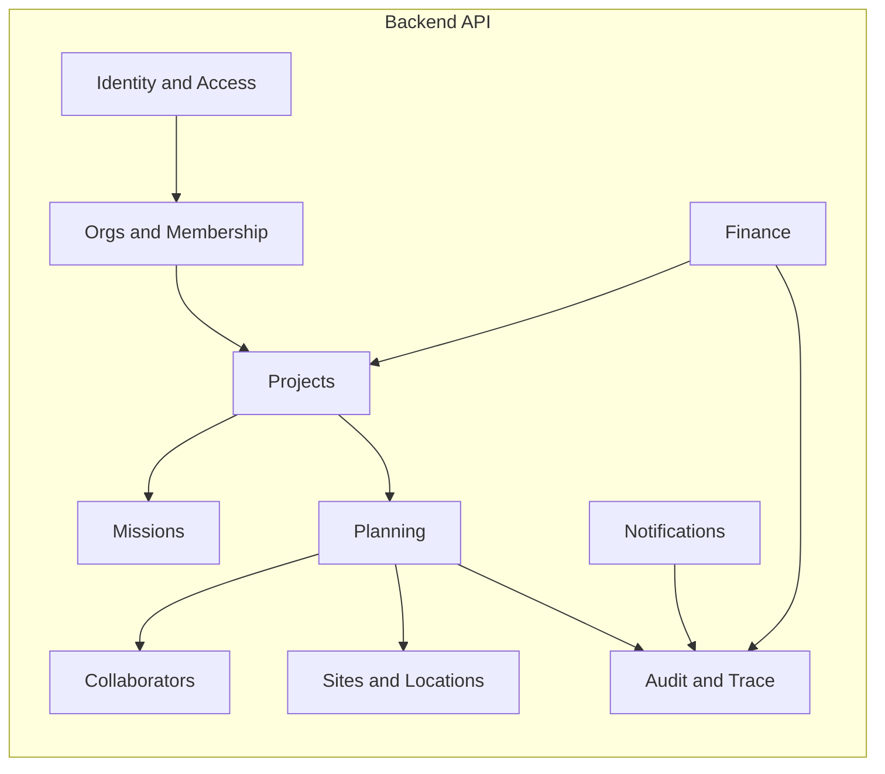

# Phase 2 - Step 01: High Level Architecture (HLD)

## Purpose and Scope
- Define the high level technical architecture for the multi-tenant planning SaaS for Phase 2 Step 01.
- Lock system, service, and trust boundaries before low-level or schema design.
- Establish authoritative sync and async flows without implementing features or UI.

## Non-Goals
- No endpoint-level detail or exhaustive API inventory.
- No database schema definitions or migrations.
- No UI design or component implementation.
- No CI/CD pipeline changes.

## System Context
### Actors
- Human users: planner, project admin, org admin, viewer, accountant.
- External services: email provider, optional SMS provider, optional map provider.
- Internal async workers executing queued jobs.

### Core Components
- Web frontend (presentation and interaction only).
- Backend API (single enforcement point for business rules and RBAC).
- Database (PostgreSQL as system of record, tenanted by org_id).
- Cache layer (Redis or equivalent) for caching, locks, and coordination.
- Async job runner and queue for notification and export workloads.

## Boundary Principles
- Organization is the security boundary; no cross-organization data access.
- Project is the functional boundary; no planning outside a project.
- Business rules execute in the backend exclusively.
- Frontend handles presentation, interaction, and request orchestration only.

## Logical Service Boundaries
Initial deployment may be a single backend service, but logical modules are bounded as follows:
1. Identity and Access: authentication, sessions/tokens, RBAC enforcement helpers.
2. Orgs and Membership: organization settings, member records, invitations.
3. Projects: project lifecycle, metadata, and scoping helpers.
4. Missions: missions within projects.
5. Planning: shift templates, shift instances, assignments, conflict evaluation entrypoints.
6. Collaborators: collaborator profiles, skills, roles, availability.
7. Sites and Locations: sites, addresses, optional map lookups.
8. Finance (read model first): rates, cost estimation exports, invoicing export interface.
9. Notifications: in-app notifications and optional emails.
10. Audit and Trace: immutable audit log and read APIs.

## Data Stores (Logical)
- PostgreSQL: system of record, scoped by org_id and project_id as applicable.
- Redis or equivalent: cache, locks, idempotency keys, and job coordination (optional in early stage).
- Object storage: optional for attachments and export artifacts.

## Trust Boundaries
1. Browser to API: TLS, authenticated tokens, CSRF policy when cookies are used.
2. API to Database: server-side access only with parameterized queries.
3. API to External Providers: secrets remain server-side; outbound calls use retries and timeouts.
4. Async Workers: same trust level as API; enforce idempotency and audit coverage.

## Primary Synchronous Flows
### Flow A: Read planning surface
1. Frontend requests project planning window.
2. API returns shifts, assignments, and conflict summary.
3. Frontend renders the timeline and badges.

### Flow B: User edits assignment (drag/drop)
1. Frontend sends PATCH assignment (or POST move).
2. API validates RBAC and invariants.
3. API evaluates conflicts (hard/soft).
4. API commits the write and records an audit event.
5. API returns updated state and conflicts.

### Flow C: Publish planning
1. Frontend calls POST publish.
2. API validates request and project scope.
3. API records publication state and audit trail.
4. API triggers async notifications.

## Primary Asynchronous Flows
### Async 1: Notifications fan-out
- Triggered by events such as assignment updates or publish actions.
- Worker sends in-app notifications and optional emails.
- Must be idempotent and record audit events for dispatch attempts.

### Async 2: Export generation
- Finance exports (cost, invoice) generated asynchronously.
- Worker produces file artifacts stored in object storage.
- API exposes status and download links.

### Async 3: Auto-assign (future)
- API starts a job to compute proposal sets.
- Worker computes draft suggestions stored as proposals.
- Requires explicit human validation before applying changes.

## Diagram 1 - System Context
```mermaid
flowchart TB
  User[Human User] -->|HTTPS| FE[Web Frontend]
  FE -->|HTTPS| API[Backend API]
  API --> DB[(PostgreSQL)]
  API --> Cache[(Redis/Cache)]

  API -->|enqueue| Q[Job Queue]
  Q --> W[Async Worker]
  W --> DB

  W --> Email[Email Provider]
  W --> SMS[SMS Provider (optional)]
  API --> Maps[Maps Provider (optional)]

  API --> Audit[(Audit Log in DB)]
  W --> Audit
```

## Diagram 2 - Module Boundaries


## Compliance and Traceability
- Roadmap linkage: Phase 2 Step 01 - High Level Architecture.
- ASCII-only content; no feature implementation.
- Business rules remain server-side; planning and missions stay project-scoped.
